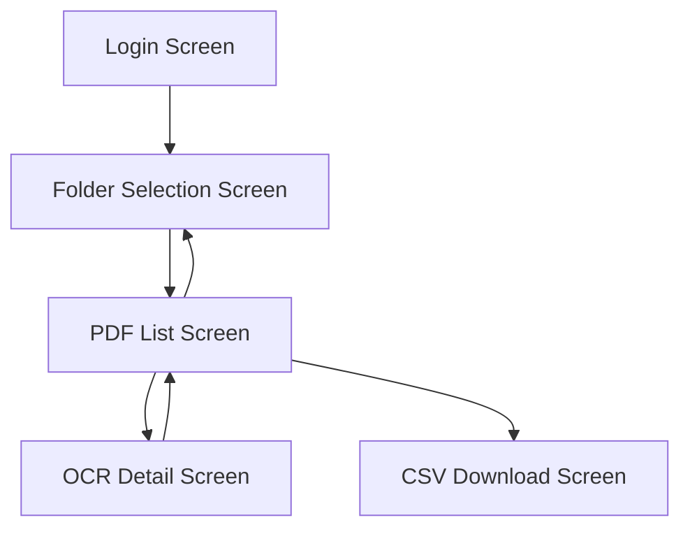

# List of Screens

1. Login Screen
   - Purpose: Authentication with the user's Google account
   - Main Function: Google Login Button

2. Folder Selection Screen
   - Purpose: Select the Google Drive folder for OCR processing
   - Main Function: Folder list display, Folder selection function

3. PDF List Screen
   - Purpose: List display of PDF files in the selected folder
   - Main Function: PDF file list, Status display, Link to detail screen

4. OCR Detail Screen
   - Purpose: Display and edit OCR results
   - Main Function: OCR result text display & editing, PDF preview, Save function, Navigation

5. CSV Download Screen
   - Purpose: CSV export of OCR results
   - Main Function: CSV Download Button, Progress display
   
---

# Screen Transition Diagram

