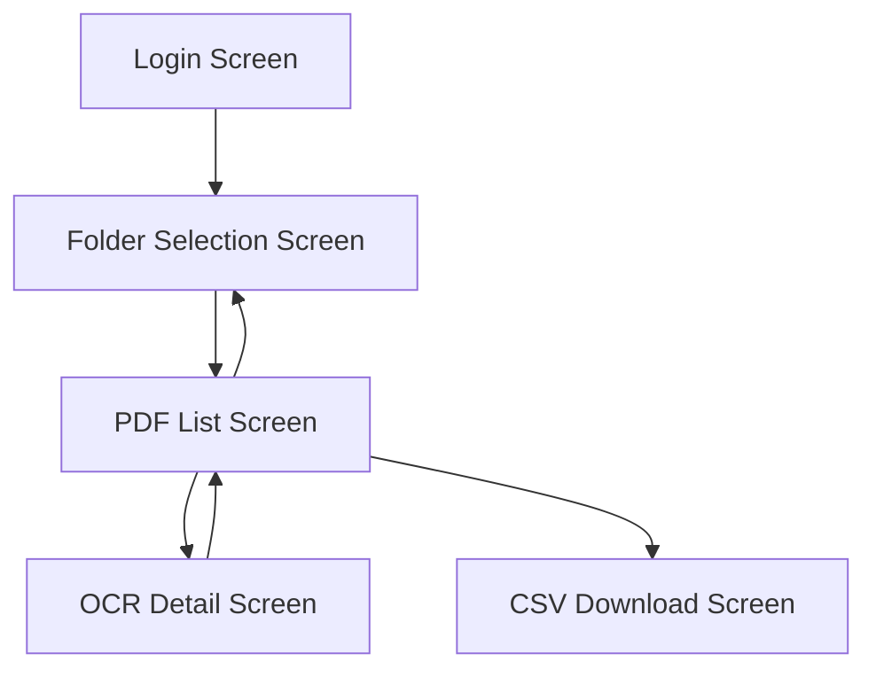

# List of Screens

1. Login Screen
   - Purpose: Authentication with the user's Google account
   - Main Features: Google login button

2. Folder Selection Screen
   - Purpose: Selection of Google Drive folder for OCR processing
   - Main Features: Folder list display, folder selection function

3. PDF List Screen
   - Purpose: List display of PDF files in the selected folder
   - Main Features: PDF file list, status display, link to detail screen

4. OCR Detail Screen
   - Purpose: Display and editing of OCR results
   - Main Features: Display & editing of OCR result text, PDF preview, save function, navigation

5. CSV Download Screen
   - Purpose: CSV export of OCR results
   - Main Features: CSV download button, progress display
   
---

# Screen Transition Diagram

