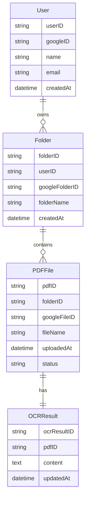

## テーブル構造

### User table

| フィールド名 | データ型 |
|--------------|----------|
| userID       | string   |
| googleID     | string   |
| name         | string   |
| email        | string   |
| createdAt    | datetime |

### Folder

| フィールド名      | データ型 |
|-------------------|----------|
| folderID          | string   |
| userID            | string   |
| googleFolderID    | string   |
| folderName        | string   |
| createdAt         | datetime |

### PDFFile

| フィールド名   | データ型 |
|----------------|----------|
| pdfID          | string   |
| folderID       | string   |
| googleFileID   | string   |
| fileName       | string   |
| uploadedAt     | datetime |
| status         | string   |

### OCRResult

| フィールド名  | データ型 |
|---------------|----------|
| ocrResultID   | string   |
| pdfID         | string   |
| content       | text     |
| updatedAt     | datetime |

# ER Diagram

