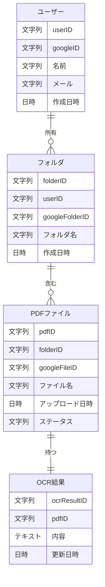

## テーブル構造

### ユーザー
| フィールド名 | データ型 |
|------------|-----------|
| userID     | 文字列    |
| googleID   | 文字列    |
| 名前       | 文字列    |
| メール     | 文字列    |
| 作成日時   | 日時  |

### フォルダ
| フィールド名      | データ型 |
|-----------------|-----------|
| folderID        | 文字列    |
| userID          | 文字列    |
| googleFolderID  | 文字列    |
| フォルダ名     | 文字列    |
| 作成日時       | 日時  |

### PDFファイル

| フィールド名     | データ型 |
|----------------|-----------|
| pdfID          | 文字列    |
| folderID       | 文字列    |
| googleFileID   | 文字列    |
| ファイル名     | 文字列    |
| アップロード日時 | 日時  |
| ステータス     | 文字列    |

### OCR結果

| フィールド名  | データ型 |
|-------------|-----------|
| ocrResultID | 文字列    |
| pdfID       | 文字列    |
| 内容       | テキスト  |
| 更新日時   | 日時  |

# ER図
