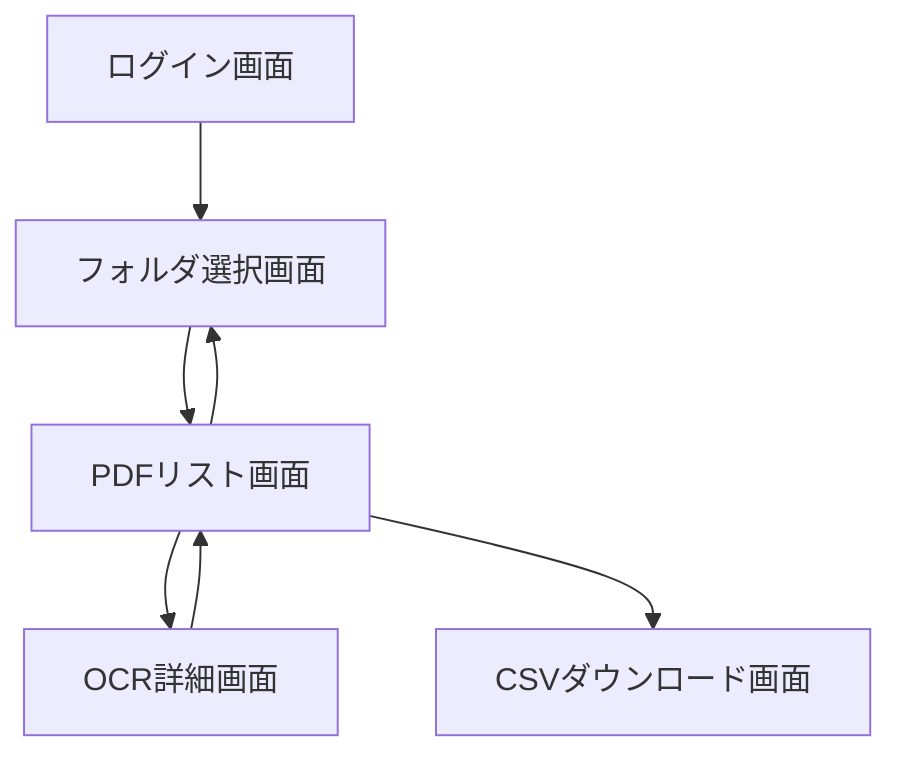

# 画面一覧

1. ログイン画面
   - 目的：ユーザーのGoogleアカウントでの認証
   - 主な機能：Googleログインボタン

2. フォルダ選択画面
   - 目的：OCR処理のためのGoogle Driveフォルダの選択
   - 主な機能：フォルダリストの表示、フォルダ選択機能

3. PDFリスト画面
   - 目的：選択したフォルダ内のPDFファイルのリスト表示
   - 主な機能：PDFファイルリスト、ステータス表示、詳細画面へのリンク

4. OCR詳細画面
   - 目的：OCR結果の表示と編集
   - 主な機能：OCR結果テキストの表示＆編集、PDFプレビュー、保存機能、ナビゲーション

5. CSVダウンロード画面
   - 目的：OCR結果のCSVエクスポート
   - 主な機能：CSVダウンロードボタン、進行状況表示
   
---

# 画面遷移図

