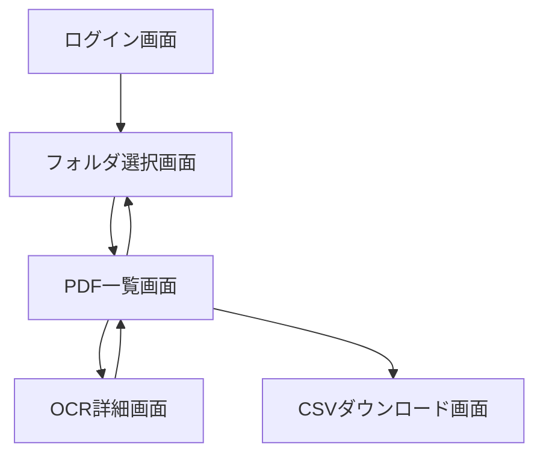

# 画面一覧

1. ログイン画面
   - 目的: ユーザーのGoogleアカウントでの認証
   - 主要機能: Googleログインボタン

2. フォルダ選択画面
   - 目的: OCR処理対象のGoogle Driveフォルダを選択
   - 主要機能: フォルダ一覧表示、フォルダ選択機能

3. PDF一覧画面
   - 目的: 選択されたフォルダ内のPDFファイルを一覧表示
   - 主要機能: PDFファイル一覧、ステータス表示、詳細画面へのリンク

4. OCR詳細画面
   - 目的: OCR結果の表示と編集
   - 主要機能: OCR結果テキスト表示・編集、PDFプレビュー、保存機能、ナビゲーション

5. CSVダウンロード画面
   - 目的: OCR結果のCSVエクスポート
   - 主要機能: CSVダウンロードボタン、進行状況表示

---

# 画面遷移図

