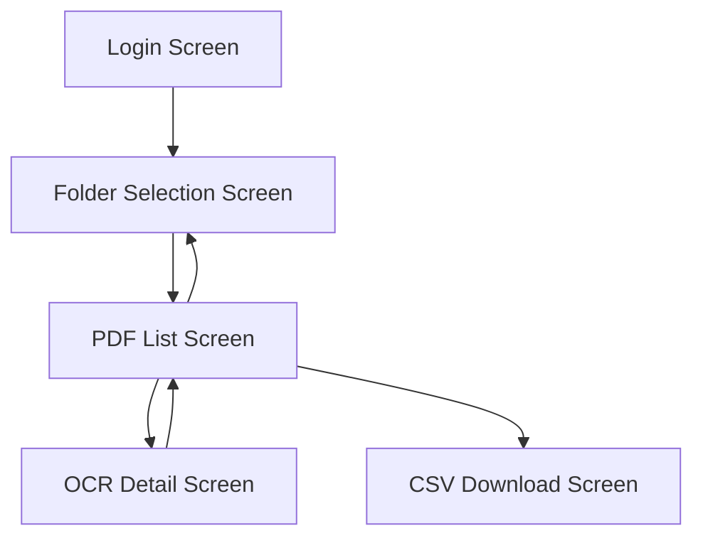

## Entity-Relationship-Diagram.md

### ファイル内容
```markdown
## Table Structure

### User
| Field Name | Data Type |
|--------------|----------|
| userID       | String   |
| googleID     | String   |
| Name         | String   |
| Email        | String   |
| Creation Date Time    | Date Time |

### Folder
| Field Name      | Data Type |
|-------------------|----------|
| folderID          | String   |
| userID            | String   |
| googleFolderID    | String   |
| Folder Name        | String   |
| Creation Date Time         | Date Time |

### PDF File

| Field Name   | Data Type |
|----------------|----------|
| pdfID          | String   |
| folderID       | String   |
| googleFileID   | String   |
| File Name       | String   |
| Upload Date Time | Date Time |
| Status             | String   |

### OCR Result

| Field Name  | Data Type |
|---------------|----------|
| ocrResultID   | String   |
| pdfID         | String   |
| Content           | Text |
| Update Date Time     | Date Time |


# ER Diagram
```mermaid
erDiagram
    User {
        String userID
        String googleID
        String Name
        String Email
        Date Time Creation Date Time
    }

    Folder {
        String folderID
        String userID
        String googleFolderID
        String Folder Name
        Date Time Creation Date Time
    }

    PDF File {
        String pdfID
        String folderID
        String googleFileID
        String File Name
        Date Time Upload Date Time
        String Status
    }

    OCR Result {
        String ocrResultID
        String pdfID
        Text Content
        Date Time Update Date Time
    }

    User ||--o{ Folder : Owns
    Folder ||--o{ PDF File : Contains
    PDF File ||--|| OCR Result : Has
```
```

### レビュー内容


## List-of-Design-Documents.md

### ファイル内容
```markdown
# Design Document List

## 1. Screen Design
### 1.1 Screen List
- Login Screen
- Folder Selection Screen
- PDF List Screen
- OCR Detail Screen
- CSV Download Screen
- Folder Selection Screen

### 1.2 Screen Transition Diagram
Document showing the transition between screens

### 1.3 Layout Design of Each Screen
Wireframes and detailed UI specifications for each screen

## 2. Database Design
### 2.1 ER Diagram
Document showing the relationship between entities

### 2.2 Table Definition Document
Detailed description of each table's columns, data types, constraints, etc.

## 3. API Design
### 3.1 API List
List of APIs to be implemented, including endpoints, methods, parameters, etc.

### 3.2 API Specification Document
Detailed specifications for each API, including request/response formats

## 4. Architecture Design
### 4.1 System Configuration Diagram
Diagram showing the relationship between Next.js, Vercel, Google API, etc.

### 4.2 Component Design
Explanation of the structure and hierarchy of React components

## 5. Security Design
### 5.1 Authentication & Authorization Flow
Detailed flow of authentication and authorization using Google OAuth 2.0

### 5.2 Data Protection Policy
Details of encryption methods, access control, etc.

## 6. External Service Integration Design
### 6.1 Google Drive API Integration Specifications
Details of API usage, scope, limitations, etc.

## 7. Error Handling Design
Definition of various errors and how they are displayed to the user

## 8. Performance Design
Policy on improving response time and handling simultaneous access

## 9. Test Plan
Plan and policy for unit tests, integration tests, E2E tests

## 10. Deployment Design
Details of the deployment flow using Vercel
```

### レビュー内容


## List-of-APIs.md

### ファイル内容
```markdown
# API Design
## 1. User Authentication API
- **Endpoint:** `/api/auth/google`
- **Method:** GET
- **Description:** Initiates Google OAuth authentication and redirects the user to the Google authentication screen.
- **Request Parameters:** None
- **Response:**
  - **Success:** Redirect to Google's authentication screen
  - **Error:** Returns an appropriate error message.

## 2. Folder List Retrieval API
- **Endpoint:** `/api/folders`
- **Method:** GET
- **Description:** Retrieves a list of folders from the user's Google Drive.
- **Request Parameters:** None
- **Response:**
  - **Success:**
    ```json
    {
      "folders": [
        {
          "id": "folderId1",
          "name": "Folder Name 1",
          "createdAt": "2023-10-01T12:00:00Z"
        },
        {
          "id": "folderId2",
          "name": "Folder Name 2",
          "createdAt": "2023-10-02T15:30:00Z"
        }
      ]
    }
    ```
  - **Error:** Returns an error message.

## 3. Folder Selection API
- **Endpoint:** `/api/folders/select`
- **Method:** POST
- **Description:** Selects a folder for OCR processing.
- **Request Parameters:**
  - `folderId` (string): The ID of the folder to be selected
    ```json
    {
      "folderId": "Selected Folder ID"
    }
    ```
- **Response:**
  - **Success:**
    ```json
    {
      "message": "The folder has been selected successfully.",
      "folderId": "Selected Folder ID"
    }
    ```
  - **Error:** Returns an error message.

## 4. PDF List Retrieval API
- **Endpoint:** `/api/pdfs`
- **Method:** GET
- **Description:** Retrieves a list of PDF files in the selected folder.
- **Request Parameters:** None
- **Response:**
  - **Success:**
    ```json
    {
      "pdfs": [
        {
          "id": "pdfId1",
          "name": "File Name 1.pdf",
          "uploadedAt": "2023-10-03T10:00:00Z",
          "status": "Processing Complete"
        },
        {
          "id": "pdfId2",
          "name": "File Name 2.pdf",
          "uploadedAt": "2023-10-04T11:30:00Z",
          "status": "Processing"
        }
      ]
    }
    ```
  - **Error:** Returns an error message.

## 5. OCR Result Retrieval API
- **Endpoint:** `/api/ocr/:pdfId`
- **Method:** GET
- **Description:** Retrieves the OCR result of a specific PDF file.
- **Request Parameters:**
  - `pdfId` (string): The ID of the PDF file to retrieve the OCR result
- **Response:**
  - **Success:**
    ```json
    {
      "pdfId": "pdfId1",
      "content": "Text content extracted by OCR"
    }
    ```
  - **Error:** Returns an error message.

## 6. OCR Result Update API
- **Endpoint:** `/api/ocr/:pdfId`
- **Method:** PUT
- **Description:** Updates the OCR result.
- **Request Parameters:**
  - `pdfId` (string): The ID of the PDF file to update the OCR result
  - Body:
    ```json
    {
      "content": "Updated OCR text content"
    }
    ```
- **Response:**
  - **Success:**
    ```json
    {
      "message": "The OCR result has been updated successfully.",
      "pdfId": "pdfId1"
    }
    ```
  - **Error:** Returns an error message.

## 7. CSV Export API
- **Endpoint:** `/api/export/csv`
- **Method:** GET
- **Description:** Exports all OCR results in CSV format.
- **Request Parameters:** None
- **Response:**
  - **Success:** Downloads a CSV file.
  - **Error:** Returns an error message.
```

### レビュー内容


## List-of-Screens.md

### ファイル内容
```markdown
# List of Screens

1. Login Screen
   - Purpose: Authentication with the user's Google account
   - Main Function: Google Login Button

2. Folder Selection Screen
   - Purpose: Select the Google Drive folder for OCR processing
   - Main Function: Folder list display, Folder selection function

3. PDF List Screen
   - Purpose: List display of PDF files in the selected folder
   - Main Function: PDF file list, Status display, Link to detail screen

4. OCR Detail Screen
   - Purpose: Display and edit OCR results
   - Main Function: OCR result text display & editing, PDF preview, Save function, Navigation

5. CSV Download Screen
   - Purpose: CSV export of OCR results
   - Main Function: CSV Download Button, Progress display
   
---


# Screen Transition Diagram


```

### レビュー内容


## System-Configuration-Diagram.md

### ファイル内容
```markdown
# System Configuration Diagram

## Component Description

1. **Client**
   - Browser: The interface through which users access the application

2. **Vercel**
   - Next.js Application: The main application that includes frontend and server-side logic
   - API Routes: API routes of Next.js that provide backend functions
   - Vercel KV: A fast key-value store used for session management and caching
   - Vercel Blob Storage: Stores large data such as PDF files and OCR results

3. **External Services**
   - Google OAuth: Used for user authentication
   - Google Drive API: Integration with the user's Google Drive
   - OCR Service: An external OCR service for character recognition from PDFs

## Data Flow

1. The user accesses the application from the browser
2. The Next.js application provides the UI and calls API Routes as needed
3. API Routes perform various processes and communicate with external services as needed
4. Vercel KV and Blob Storage are used for data persistence
5. Authentication information and temporary data are stored in Vercel KV
6. PDF files and OCR results are stored in Blob Storage


## Security

- All communication is encrypted with HTTPS
- Secure authentication is achieved using Google OAuth
- Confidential information is protected using environment variable management provided by Vercel

## Scalability
- Vercel's automatic scaling function allows for handling increased traffic
- Vercel KV and Blob Storage allow for flexible response to increased data volume
```

### レビュー内容


## Requirement-Definition.md

### ファイル内容
```markdown
## Document
https://japan-marketing-co-jp.gitbook.io/bizmate/

---

# Requirements Specification Document

## 1. Introduction
This document is a requirements specification for the development of a web application for OCR services. This service allows users to log in with their Google account, automatically import PDF files from a specified Google Drive, and perform OCR processing. The processing results can be viewed and edited on the web, and can also be downloaded in CSV format.

## 2. System Overview
**Platform:** Web Application  
**Technology Stack:**  
- Frontend: Next.js (Vercel), TypeScript
- Backend, Database, Storage: Vercel
- User Authentication: Google login only

## 3. Functional Requirements

### 3.1 User Authentication
- Google login feature
- Login with Google account using OAuth 2.0
- No other login methods are provided


### 3.2 Google Drive Integration
- **Google Drive Selection:**  
  After logging in, the user selects a folder from their Google Drive
- **PDF Data Import:**  
  Automatically import PDF files uploaded to the selected folder and save them in Vercel's storage  
  Import in real-time when a new upload is made

### 3.3 PDF List Display
- **PDF File List Display:**  
  Display imported PDF files in a list format  
  Display information such as file name, upload date, processing status, etc.

### 3.4 OCR Result Display
- **Simultaneous Display of OCR Results and PDF:**  
  In the detail screen, display the OCR results on the left and the PDF preview on the right  
  OCR results can be edited in a text area

### 3.5 OCR Detail Screen
- **Save Feature:**  
  Confirm and save OCR results with the "Save" button
- **Navigation:**  
  Place "Next" and "Back" buttons in the header to facilitate movement to other files

### 3.6 CSV Download
- **OCR Result Export:**  
  Bulk download of all OCR results in CSV format  
  Provide a download button

## 4. Non-Functional Requirements

### 4.1 Performance
- **Response Time:**  
  Page transitions and data loads are completed within 3 seconds
- **Simultaneous Access:**  
  Maintain performance even when multiple users are using the service simultaneously

### 4.2 Security
- **Data Protection:**  
  User data is stored encrypted
- **Access Restriction:**  
  Restrict access to data for each user

### 4.3 Usability
- **Intuitive UI:**  
  Design that allows even first-time users to operate without hesitation
- **Responsive Design:**  
  Compatible with access from PCs, tablets, and smartphones

## 5. System Configuration

### 5.1 Frontend
- **Next.js:**  
  Fast page display with server-side rendering
- **TypeScript:**  
  Safe code writing with type definitions

### 5.2 Backend
- **API Routes:**  
  Implement server-side processing using Next.js API routes
- **Database & Storage:**  
  Use the database service provided on Vercel

### 5.3 External Service Integration
- **Google API:**  
  Access files using Google Drive API  
  Implement authentication and authorization with Google OAuth 2.0

## 6. User Interface Details

### 6.1 Login Screen
- **Google Login Button:**  
  Redirect to Google's authentication screen when clicked

### 6.2 Folder Selection Screen
- **Google Drive Folder List Display:**  
  Select a folder from the user's Drive

### 6.3 PDF List Screen
- **File List:**  
  Display thumbnail, file name, status
- **Operation:**  
  Click on the file to transition to the detail screen

### 6.4 OCR Detail Screen
- **Display Area:**  
  Left side: OCR result text area (editable)  
  Right side: PDF preview
- **Operation Buttons:**  
  Place "Next", "Back", and "Save" buttons in the header

### 6.5 CSV Download Screen
- **Download Button:**  
  Generate and download a CSV file when clicked
- **Progress Display:**  
  Display a progress bar during download processing

## 7. Error Handling
- **Authentication Error:**  
  Display appropriate error messages when login fails
- **File Retrieval Error:**  
  If file retrieval from Google Drive fails, offer a retry option
- **Save Error:**  
  If saving OCR results fails, notify the user and prompt for data resubmission

## 8. Logs and Monitoring
- **Access Logs:**  
  Record user access conditions as logs
- **Error Logs:**  
  Record system errors and exceptions for debugging
- **Monitoring:**  
  Monitor the system's operating status in real time

## 9. Security Requirements
- **HTTPS Communication:**  
  Encrypt all communications with SSL/TLS
- **Data Encryption:**  
  Apply encryption to stored data
- **Permission Management:**  
  Implement data access control for each user

## 10. Constraints
- **Google Account Required:**  
  A Google account is required to use the service
- **Vercel Resources:**  
  Only use features that can be completed on Vercel
- **File Format:**  
  Only PDF files are supported

## 11. Development Environment
- **Development Language:**  
  TypeScript
- **Framework:**  
  Next.js
- **Hosting:**  
  Vercel

## 12. Risks and Countermeasures
- **Google API Limitations:**  
  Countermeasure: Check API usage limits and design to avoid exceeding them
- **Data Security:**  
  Countermeasure: Thoroughly implement data encryption and access control
```

### レビュー内容


## Component-Design.md

### ファイル内容
```markdown
# React Component Design

## Component Description
1. **App**: Root component of the application
2. **Layout**: Component providing common layout
   - Header: Displays the header section
   - Footer: Displays the footer section
   - Main Content: Main content area
   - Sidebar: Displays the sidebar section

3. **Page Components**:
   - LoginPage: Login screen
   - FolderSelectionPage: Google Drive folder selection screen
   - PDFListPage: PDF file list screen
   - OCRDetailPage: OCR result detail and editing screen
   - CSVDownloadPage: CSV download screen

4. **Reusable Components**:
   - PDFListItem: Displays each item in the PDF list
   - OCRTextEditor: Component for editing OCR text
   - PDFViewer: Component for previewing PDFs
   - NavigationButtons: Navigation buttons for "Next" and "Back"

## State Management

- Global state (user information, selected folder, etc.) is managed using React Context or Redux
- Local state (form inputs, temporary UI state, etc.) is managed using React's useState hook

## Data Retrieval

- If server-side rendering is required, use Next.js's getServerSideProps
- For client-side data retrieval, use React Query to optimize caching and re-fetching

## Error Handling

- Create a global error handling component to catch and display errors across the application

## Accessibility

- Use semantic HTML elements
- Properly set ARIA attributes
- Support keyboard navigation
```

### レビュー内容
