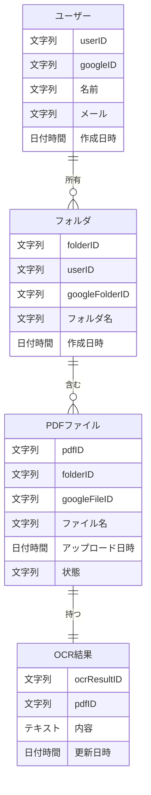
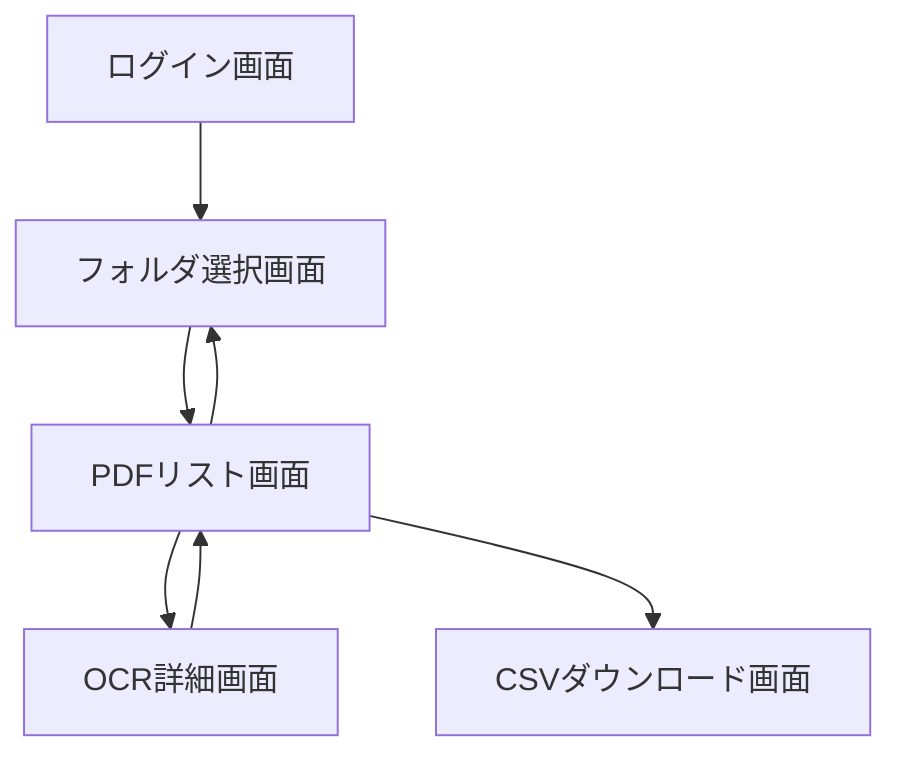

## Entity-Relationship-Diagram.md

### ファイル内容
```markdown
## テーブル構造

### ユーザー
| フィールド名 | データ型 |
|--------------|----------|
| userID       | 文字列   |
| googleID     | 文字列   |
| 名前         | 文字列   |
| メール        | 文字列   |
| 作成日時    | 日付時間 |

### フォルダ
| フィールド名      | データ型 |
|-------------------|----------|
| folderID          | 文字列   |
| userID            | 文字列   |
| googleFolderID    | 文字列   |
| フォルダ名        | 文字列   |
| 作成日時         | 日付時間 |

### PDFファイル

| フィールド名   | データ型 |
|----------------|----------|
| pdfID          | 文字列   |
| folderID       | 文字列   |
| googleFileID   | 文字列   |
| ファイル名       | 文字列   |
| アップロード日時 | 日付時間 |
| 状態             | 文字列   |

### OCR結果

| フィールド名  | データ型 |
|---------------|----------|
| ocrResultID   | 文字列   |
| pdfID         | 文字列   |
| 内容           | テキスト |
| 更新日時     | 日付時間 |


# ER図

```

### レビュー内容


## List-of-Design-Documents.md

### ファイル内容
```markdown
# デザインドキュメントリスト

## 1. 画面設計
### 1.1 画面リスト
- ログイン画面
- フォルダ選択画面
- PDFリスト画面
- OCR詳細画面
- CSVダウンロード画面
- フォルダ選択画面

### 1.2 画面遷移図
画面間の遷移を示すドキュメント

### 1.3 各画面のレイアウト設計
各画面のワイヤーフレームと詳細なUI仕様

## 2. データベース設計
### 2.1 ER図
エンティティ間の関係を示すドキュメント

### 2.2 テーブル定義書
各テーブルのカラム、データ型、制約などの詳細な説明

## 3. API設計
### 3.1 APIリスト
実装されるAPIのリスト、エンドポイント、メソッド、パラメータなどを含む

### 3.2 API仕様書
各APIの詳細な仕様、リクエスト/レスポンス形式を含む

## 4. アーキテクチャ設計
### 4.1 システム構成図
Next.js、Vercel、Google APIなどの間の関係を示す図

### 4.2 コンポーネント設計
Reactコンポーネントの構造と階層の説明

## 5. セキュリティ設計
### 5.1 認証・認可フロー
Google OAuth 2.0を使用した認証と認可の詳細なフロー

### 5.2 データ保護ポリシー
暗号化方法、アクセス制御などの詳細

## 6. 外部サービス統合設計
### 6.1 Google Drive API統合仕様
APIの使用、範囲、制限などの詳細

## 7. エラーハンドリング設計
さまざまなエラーの定義とユーザーへの表示方法

## 8. パフォーマンス設計
応答時間の改善と同時アクセスの処理に関する方針

## 9. テスト計画
ユニットテスト、統合テスト、E2Eテストの計画と方針

## 10. デプロイ設計
Vercelを使用したデプロイフローの詳細
```

### レビュー内容


## List-of-APIs.md

### ファイル内容
```markdown
# API設計
## 1. ユーザー認証API
- **エンドポイント:** `/api/auth/google`
- **メソッド:** GET
- **説明:** Google OAuth認証を開始し、ユーザーをGoogleの認証画面にリダイレクトします。
- **リクエストパラメータ:** なし
- **レスポンス:**
  - **成功:** Googleの認証画面にリダイレクト
  - **エラー:** 適切なエラーメッセージを返します。

## 2. フォルダリスト取得API
- **エンドポイント:** `/api/folders`
- **メソッド:** GET
- **説明:** ユーザーのGoogleドライブからフォルダのリストを取得します。
- **リクエストパラメータ:** なし
- **レスポンス:**
  - **成功:**
    ```json
    {
      "folders": [
        {
          "id": "folderId1",
          "name": "フォルダ名1",
          "createdAt": "2023-10-01T12:00:00Z"
        },
        {
          "id": "folderId2",
          "name": "フォルダ名2",
          "createdAt": "2023-10-02T15:30:00Z"
        }
      ]
    }
    ```
  - **エラー:** エラーメッセージを返します。

## 3. フォルダ選択API
- **エンドポイント:** `/api/folders/select`
- **メソッド:** POST
- **説明:** OCR処理のためのフォルダを選択します。
- **リクエストパラメータ:**
  - `folderId` (string): 選択するフォルダのID
    ```json
    {
      "folderId": "選択したフォルダのID"
    }
    ```
- **レスポンス:**
  - **成功:**
    ```json
    {
      "message": "フォルダが正常に選択されました。",
      "folderId": "選択したフォルダのID"
    }
    ```
  - **エラー:** エラーメッセージを返します。

## 4. PDFリスト取得API
- **エンドポイント:** `/api/pdfs`
- **メソッド:** GET
- **説明:** 選択したフォルダ内のPDFファイルのリストを取得します。
- **リクエストパラメータ:** なし
- **レスポンス:**
  - **成功:**
    ```json
    {
      "pdfs": [
        {
          "id": "pdfId1",
          "name": "ファイル名1.pdf",
          "uploadedAt": "2023-10-03T10:00:00Z",
          "status": "処理完了"
        },
        {
          "id": "pdfId2",
          "name": "ファイル名2.pdf",
          "uploadedAt": "2023-10-04T11:30:00Z",
          "status": "処理中"
        }
      ]
    }
    ```
  - **エラー:** エラーメッセージを返します。

## 5. OCR結果取得API
- **エンドポイント:** `/api/ocr/:pdfId`
- **メソッド:** GET
- **説明:** 特定のPDFファイルのOCR結果を取得します。
- **リクエストパラメータ:**
  - `pdfId` (string): OCR結果を取得するPDFファイルのID
- **レスポンス:**
  - **成功:**
    ```json
    {
      "pdfId": "pdfId1",
      "content": "OCRによって抽出されたテキストコンテンツ"
    }
    ```
  - **エラー:** エラーメッセージを返します。

## 6. OCR結果更新API
- **エンドポイント:** `/api/ocr/:pdfId`
- **メソッド:** PUT
- **説明:** OCR結果を更新します。
- **リクエストパラメータ:**
  - `pdfId` (string): OCR結果を更新するPDFファイルのID
  - ボディ:
    ```json
    {
      "content": "更新されたOCRテキストコンテンツ"
    }
    ```
- **レスポンス:**
  - **成功:**
    ```json
    {
      "message": "OCR結果が正常に更新されました。",
      "pdfId": "pdfId1"
    }
    ```
  - **エラー:** エラーメッセージを返します。

## 7. CSVエクスポートAPI
- **エンドポイント:** `/api/export/csv`
- **メソッド:** GET
- **説明:** すべてのOCR結果をCSV形式でエクスポートします。
- **リクエストパラメータ:** なし
- **レスポンス:**
  - **成功:** CSVファイルをダウンロードします。
  - **エラー:** エラーメッセージを返します。
```

### レビュー内容


## List-of-Screens.md

### ファイル内容
```markdown
# スクリーンのリスト

1. ログイン画面
   - 目的: ユーザーのGoogleアカウントでの認証
   - 主な機能: Googleログインボタン

2. フォルダ選択画面
   - 目的: OCR処理のためのGoogle Driveフォルダの選択
   - 主な機能: フォルダリスト表示、フォルダ選択機能

3. PDFリスト画面
   - 目的: 選択したフォルダ内のPDFファイルのリスト表示
   - 主な機能: PDFファイルリスト、ステータス表示、詳細画面へのリンク

4. OCR詳細画面
   - 目的: OCR結果の表示と編集
   - 主な機能: OCR結果テキストの表示＆編集、PDFプレビュー、保存機能、ナビゲーション

5. CSVダウンロード画面
   - 目的: OCR結果のCSVエクスポート
   - 主な機能: CSVダウンロードボタン、進行状況表示
   
---

# 画面遷移図


```

### レビュー内容


## System-Configuration-Diagram.md

### ファイル内容
```markdown
# システム構成図

## コンポーネント説明

1. **クライアント**
   - ブラウザ: ユーザーがアプリケーションにアクセスするインターフェース

2. **Vercel**
   - Next.jsアプリケーション: フロントエンドとサーバーサイドのロジックを含むメインのアプリケーション
   - APIルート: バックエンド機能を提供するNext.jsのAPIルート
   - Vercel KV: セッション管理とキャッシングのための高速なキー値ストア
   - Vercel Blobストレージ: PDFファイルやOCR結果などの大きなデータを保存

3. **外部サービス**
   - Google OAuth: ユーザー認証に使用
   - Google Drive API: ユーザーのGoogle Driveとの統合
   - OCRサービス: PDFからの文字認識のための外部OCRサービス

## データフロー

1. ユーザーはブラウザからアプリケーションにアクセス
2. Next.jsアプリケーションがUIを提供し、必要に応じてAPIルートを呼び出す
3. APIルートは様々なプロセスを実行し、必要に応じて外部サービスと通信する
4. Vercel KVとBlobストレージはデータの永続性を担当
5. 認証情報や一時的なデータはVercel KVに保存
6. PDFファイルやOCR結果はBlobストレージに保存

## セキュリティ

- すべての通信はHTTPSで暗号化
- Google OAuthを使用した安全な認証
- Vercelが提供する環境変数管理を使用して機密情報を保護

## スケーラビリティ
- Vercelの自動スケーリング機能により、トラフィック増加に対応
- Vercel KVとBlobストレージにより、データ量増加に対する柔軟な対応が可能
```

### レビュー内容


## Requirement-Definition.md

### ファイル内容
```markdown
## ドキュメント
https://japan-marketing-co-jp.gitbook.io/bizmate/

---

# 要件仕様書

## 1. はじめに
本書は、OCRサービスのWebアプリケーション開発のための要件仕様書です。このサービスでは、ユーザーがGoogleアカウントでログインし、指定したGoogleドライブからPDFファイルを自動的にインポートし、OCR処理を行います。処理結果はWeb上で閲覧・編集が可能で、CSV形式でダウンロードすることもできます。

## 2. システム概要
**プラットフォーム:** Webアプリケーション  
**技術スタック:**  
- フロントエンド: Next.js (Vercel), TypeScript
- バックエンド, データベース, ストレージ: Vercel
- ユーザー認証: Googleログインのみ

## 3. 機能要件

### 3.1 ユーザー認証
- Googleログイン機能
- OAuth 2.0を使用してGoogleアカウントでログイン
- 他のログイン方法は提供されない

### 3.2 Googleドライブの統合
- **Googleドライブの選択:**  
  ログイン後、ユーザーはGoogleドライブからフォルダを選択
- **PDFデータのインポート:**  
  選択したフォルダにアップロードされたPDFファイルを自動的にインポートし、Vercelのストレージに保存  
  新しいアップロードがあった場合はリアルタイムでインポート

### 3.3 PDFリストの表示
- **PDFファイルリストの表示:**  
  インポートされたPDFファイルをリスト形式で表示  
  ファイル名、アップロード日、処理状況などの情報を表示

### 3.4 OCR結果の表示
- **OCR結果とPDFの同時表示:**  
  詳細画面で、OCR結果を左側に、PDFプレビューを右側に表示  
  OCR結果はテキストエリアで編集可能

### 3.5 OCR詳細画面
- **保存機能:**  
  「保存」ボタンでOCR結果を確認・保存
- **ナビゲーション:**  
  ヘッダーに「次へ」、「戻る」ボタンを配置し、他のファイルへの移動を容易にする

### 3.6 CSVダウンロード
- **OCR結果のエクスポート:**  
  全てのOCR結果をCSV形式で一括ダウンロード  
  ダウンロードボタンを提供

## 4. 非機能要件

### 4.1 パフォーマンス
- **応答時間:**  
  ページ遷移とデータロードは3秒以内に完了
- **同時アクセス:**  
  複数のユーザーが同時にサービスを使用してもパフォーマンスを維持

### 4.2 セキュリティ
- **データ保護:**  
  ユーザーデータは暗号化して保存
- **アクセス制限:**  
  ユーザーごとにデータへのアクセスを制限

### 4.3 ユーザビリティ
- **直感的なUI:**  
  初めてのユーザーでも迷わず操作できるデザイン
- **レスポンシブデザイン:**  
  PC、タブレット、スマートフォンからのアクセスに対応

## 5. システム構成

### 5.1 フロントエンド
- **Next.js:**  
  サーバーサイドレンダリングによる高速なページ表示
- **TypeScript:**  
  型定義による安全なコード記述

### 5.2 バックエンド
- **APIルート:**  
  Next.jsのAPIルートを使用したサーバーサイド処理の実装
- **データベース & ストレージ:**  
  Vercelで提供されるデータベースサービスの使用

### 5.3 外部サービスの統合
- **Google API:**  
  GoogleドライブAPIを使用してファイルにアクセス  
  Google OAuth 2.0で認証と認可を実装

## 6. ユーザーインターフェース詳細

### 6.1 ログイン画面
- **Googleログインボタン:**  
  クリックするとGoogleの認証画面にリダイレクト

### 6.2 フォルダ選択画面
- **Googleドライブフォルダリスト表示:**  
  ユーザーのドライブからフォルダを選択

### 6.3 PDFリスト画面
- **ファイルリスト:**  
  サムネイル、ファイル名、ステータスを表示
- **操作:**  
  ファイルをクリックすると詳細画面に遷移

### 6.4 OCR詳細画面
- **表示エリア:**  
  左側: OCR結果テキストエリア（編集可能）  
  右側: PDFプレビュー
- **操作ボタン:**  
  ヘッダーに「次へ」、「戻る」、「保存」ボタンを配置

### 6.5 CSVダウンロード画面
- **ダウンロードボタン:**  
  クリックするとCSVファイルを生成・ダウンロード
- **進行状況表示:**  
  ダウンロード処理中はプログレスバーを表示

## 7. エラーハンドリング
- **認証エラー:**  
  ログインに失敗した場合は適切なエラーメッセージを表示
- **ファイル取得エラー:**  
  Googleドライブからのファイル取得に失敗した場合はリトライオプションを提供
- **保存エラー:**  
  OCR結果の保存に失敗した場合はユーザーに通知し、データの再送信を促す

## 8. ログとモニタリング
- **アクセスログ:**  
  ユーザーのアクセス状況をログとして記録
- **エラーログ:**  
  システムのエラーや例外をデバッグのために記録
- **モニタリング:**  
  システムの運用状況をリアルタイムで監視

## 9. セキュリティ要件
- **HTTPS通信:**  
  SSL/TLSで全ての通信を暗号化
- **データ暗号化:**  
  保存データに暗号化を適用
- **権限管理:**
```

### レビュー内容


## Component-Design.md

### ファイル内容
```markdown
# Reactコンポーネント設計


## コンポーネントの説明
1. **App**: アプリケーションのルートコンポーネント
2. **Layout**: 共通のレイアウトを提供するコンポーネント
   - Header: ヘッダーセクションを表示
   - Footer: フッターセクションを表示
   - Main Content: メインコンテンツエリア
   - Sidebar: サイドバーセクションを表示

3. **ページコンポーネント**:
   - LoginPage: ログイン画面
   - FolderSelectionPage: Google Driveフォルダ選択画面
   - PDFListPage: PDFファイルリスト画面
   - OCRDetailPage: OCR結果詳細および編集画面
   - CSVDownloadPage: CSVダウンロード画面

4. **再利用可能なコンポーネント**:
   - PDFListItem: PDFリストの各項目を表示
   - OCRTextEditor: OCRテキストの編集用コンポーネント
   - PDFViewer: PDFのプレビュー用コンポーネント
   - NavigationButtons: "次へ"と"戻る"のナビゲーションボタン

## 状態管理

- グローバル状態（ユーザー情報、選択されたフォルダなど）はReact ContextまたはReduxを使用して管理
- ローカル状態（フォーム入力、一時的なUI状態など）はReactのuseStateフックを使用

## データ取得

- サーバーサイドレンダリングが必要な場合は、Next.jsのgetServerSidePropsを使用
- クライアントサイドのデータ取得には、キャッシュと再取得を最適化するためにReact Queryを使用

## エラーハンドリング

- アプリケーション全体でエラーをキャッチして表示するためのグローバルエラーハンドリングコンポーネントを作成

## アクセシビリティ

- セマンティックHTML要素を使用
- ARIA属性を適切に設定
- キーボードナビゲーションをサポート
```

### レビュー内容
